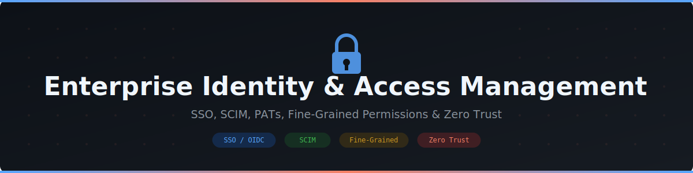

  

  

<h1 align="center">Enterprise Identity &amp; Access Management Resource Pack</h1>

  A practical guide for configuring enterprise-grade authentication, provisioning, token policies, and access governance on GitHub — from SSO and SCIM to fine-grained permissions and zero-trust access patterns.

## Contents

| # | Document | Description |
|---|----------|-------------|
| 01 | [SSO, SAML, and OIDC Configuration](./01-SSO-SAML-and-OIDC-Configuration.md) | Configuring SAML SSO and OIDC for enterprise-managed authentication |
| 02 | [Entra ID Integration and SCIM Provisioning](./02-Entra-ID-Integration-and-SCIM-Provisioning.md) | Integrating Microsoft Entra ID and automating user/team lifecycle with SCIM |
| 03 | [PAT Policies and Hardening](./03-PAT-Policies-and-Hardening.md) | Reducing risk from personal access tokens through policy, scoping, and lifecycle controls |
| 04 | [Auth Strategy: GitHub Apps vs. PATs vs. OAuth](./04-Auth-Strategy-GitHub-Apps-vs-PATs-vs-OAuth.md) | Choosing the right authentication mechanism for automation and integrations |
| 05 | [Fine-Grained Permissions and Custom Roles](./05-Fine-Grained-Permissions-and-Custom-Roles.md) | Moving beyond broad access with fine-grained PATs, custom repository roles, and least privilege |
| 06 | [Audit Logging, Access Reviews, and Zero Trust](./06-Audit-Logging-Access-Reviews-and-Zero-Trust.md) | Continuous visibility, periodic access reviews, and applying zero-trust principles to GitHub access |

## How to Use

1. **Standing up enterprise authentication?** Start with [01-SSO-SAML-and-OIDC-Configuration](./01-SSO-SAML-and-OIDC-Configuration.md) to centralize identity under your IdP.
2. **Automating user lifecycle?** Use [02-Entra-ID-Integration-and-SCIM-Provisioning](./02-Entra-ID-Integration-and-SCIM-Provisioning.md) to keep GitHub access in sync with HR/IdP changes.
3. **Reducing token-related risk?** Apply [03-PAT-Policies-and-Hardening](./03-PAT-Policies-and-Hardening.md) and [04-Auth-Strategy-GitHub-Apps-vs-PATs-vs-OAuth](./04-Auth-Strategy-GitHub-Apps-vs-PATs-vs-OAuth.md) to move automation toward more secure patterns.
4. **Tightening access boundaries?** Use [05-Fine-Grained-Permissions-and-Custom-Roles](./05-Fine-Grained-Permissions-and-Custom-Roles.md) to implement least privilege at the repository and organization level.
5. **Building continuous assurance?** Operationalize [06-Audit-Logging-Access-Reviews-and-Zero-Trust](./06-Audit-Logging-Access-Reviews-and-Zero-Trust.md) with recurring reviews and zero-trust patterns.

## Suggested Rollout Sequence

- **Week 1-2:** Configure SSO/OIDC with your identity provider and enforce it at the enterprise level.
- **Week 3-4:** Enable SCIM provisioning to automate team membership and deprovisioning.
- **Week 5-6:** Audit and harden PAT usage; publish token policy and migration guidance toward GitHub Apps.
- **Week 7-8:** Roll out fine-grained permissions and custom roles for sensitive repositories.
- **Week 8+:** Establish recurring audit log reviews and quarterly access certification.

## Reference Sources

- [About SAML for enterprise IAM](https://docs.github.com/en/enterprise-cloud@latest/admin/identity-and-access-management/using-saml-for-enterprise-iam/about-saml-for-enterprise-iam)
- [About OIDC for enterprise IAM](https://docs.github.com/en/enterprise-cloud@latest/admin/identity-and-access-management/using-oidc-for-enterprise-iam/about-oidc-for-enterprise-iam)
- [About SCIM for enterprise IAM](https://docs.github.com/en/enterprise-cloud@latest/admin/identity-and-access-management/using-scim-for-enterprise-iam/about-scim-for-enterprise-iam)
- [Managing your personal access tokens](https://docs.github.com/en/authentication/keeping-your-account-and-data-secure/managing-your-personal-access-tokens)
- [About custom repository roles](https://docs.github.com/en/organizations/managing-peoples-access-to-your-organization-with-roles/managing-custom-repository-roles-for-an-organization)
- [About the audit log for your enterprise](https://docs.github.com/en/enterprise-cloud@latest/admin/monitoring-activity-in-your-enterprise/reviewing-audit-logs-for-your-enterprise/about-the-audit-log-for-your-enterprise)
