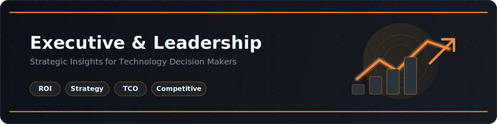

  

  

<h1 align="center">Executive &amp; Leadership Resource Pack</h1>

  A leadership-ready resource pack for CIOs, CTOs, CFO partners, platform leaders, and transformation sponsors evaluating GitHub as a strategic software platform.

## Introduction

This pack helps executive stakeholders connect GitHub investments to measurable business outcomes: lower total cost of ownership, faster delivery, better security posture, stronger developer experience, and a more defensible AI strategy. Use it to frame board-level conversations, budget requests, platform standardization decisions, and change management plans.

## Contents

| Document | Focus | Primary Audience |
| --- | --- | --- |
| [01-Why-GitHub.md](./01-Why-GitHub.md) | Market position, platform narrative, analyst perspective | CIO, CTO, VP Engineering, strategy leaders |
| [02-Total-Cost-of-Ownership.md](./02-Total-Cost-of-Ownership.md) | TCO framework, hidden costs, sample comparisons | CFO partners, procurement, platform leaders |
| [03-ROI-and-Business-Value.md](./03-ROI-and-Business-Value.md) | Productivity, security savings, time-to-market, innovation | Executive sponsors, finance, transformation teams |
| [04-Competitive-Positioning.md](./04-Competitive-Positioning.md) | GitHub vs GitLab, Azure DevOps, Bitbucket | Decision committees, architecture, procurement |
| [05-Executive-Presentation-Template.md](./05-Executive-Presentation-Template.md) | Slide-by-slide template with speaker notes | Account teams, internal champions, leadership presenters |

## How to Use

1. **Start with the narrative:** Use [01-Why-GitHub.md](./01-Why-GitHub.md) to establish why GitHub matters strategically.
2. **Build the financial case:** Use [02-Total-Cost-of-Ownership.md](./02-Total-Cost-of-Ownership.md) and [03-ROI-and-Business-Value.md](./03-ROI-and-Business-Value.md) to quantify savings and upside.
3. **Prepare for competitive scrutiny:** Use [04-Competitive-Positioning.md](./04-Competitive-Positioning.md) for side-by-side comparisons and likely objections.
4. **Present with confidence:** Use [05-Executive-Presentation-Template.md](./05-Executive-Presentation-Template.md) to structure leadership discussions.
5. **Localize the content:** Replace sample assumptions with your organization's headcount, spend profile, delivery metrics, and risk posture.
