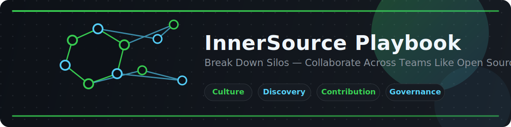

  

  

<h1 align="center">InnerSource Playbook</h1>

  A practical guide for helping teams discover, contribute to, and govern shared internal software the same way successful open source communities work.

## Introduction

InnerSource applies open source collaboration practices inside an organization. Instead of limiting repositories to one team, it makes shared codebases easier to discover, safer to contribute to, and clearer to govern. This playbook is designed for engineering leaders, maintainers, platform teams, and contributors who want to reduce duplication, accelerate delivery, and spread knowledge through transparent collaboration.

## Contents

| Guide | Focus | Link |
| --- | --- | --- |
| 01 | Foundations and terminology | [What is InnerSource?](./01-What-is-InnerSource.md) |
| 02 | Repository setup and discoverability | [Setting Up for InnerSource](./02-Setting-Up-for-InnerSource.md) |
| 03 | Working agreements for contributors | [Contribution Guidelines](./03-Contribution-Guidelines.md) |
| 04 | Ownership, trust, and decision-making | [Governance and Ownership](./04-Governance-and-Ownership.md) |
| 05 | Metrics and continuous improvement | [Measuring Success](./05-Measuring-Success.md) |

## How to Use

1. **Start with shared vocabulary.** Read the first guide with stakeholders to align on goals, expectations, and maturity.
2. **Improve discoverability first.** Make repositories searchable, understandable, and welcoming before pushing for more contributions.
3. **Adopt contribution workflows incrementally.** Pilot the practices in one or two cross-team repositories, then standardize templates and review norms.
4. **Define governance explicitly.** Clarify ownership, review SLAs, escalation paths, and decision rights as adoption grows.
5. **Measure outcomes, not just activity.** Use the success metrics guide to track collaboration quality, reuse, and impact over time.

## Recommended Reading Order

- New to the topic: **01 → 02 → 03**
- Maintainers of shared platforms: **02 → 03 → 04**
- Engineering leaders and program owners: **01 → 04 → 05**

## Who This Is For

- Platform and developer experience teams
- Shared service or framework maintainers
- Engineering managers and directors
- Staff engineers driving cross-team standards
- Contributors onboarding to internal shared codebases
