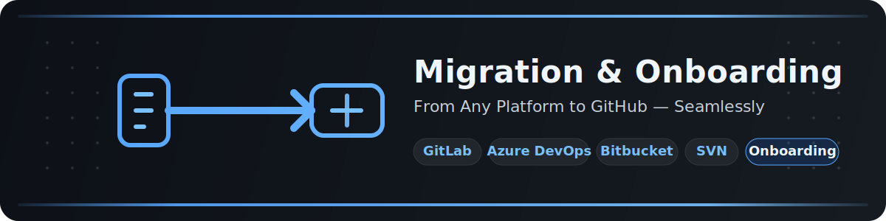

  

  

<h1 align="center">Migration &amp; Onboarding Resource Pack</h1>

  A practical guide for planning platform migrations, moving delivery workflows to GitHub, and onboarding developers quickly with consistent standards, tooling, and governance.

## Contents

| # | Document | Description |
|---|----------|-------------|
| 01 | [Migration Planning](01-Migration-Planning.md) | Assessment framework, migration strategies, risk management, and communications planning |
| 02 | [Migrating from Azure DevOps](02-Migrating-from-Azure-DevOps.md) | Repositories, pipelines, boards, identities, packages, and importer guidance |
| 03 | [Migrating from GitLab](03-Migrating-from-GitLab.md) | Projects, LFS, CI/CD, issues, merge requests, registry, and migration gotchas |
| 04 | [Migrating from Bitbucket and SVN](04-Migrating-from-Bitbucket-and-SVN.md) | Bitbucket Cloud/Server paths, SVN conversion, history preservation, and monorepo considerations |
| 05 | [Developer Onboarding Guide](05-Developer-Onboarding-Guide.md) | Day-one setup checklist, GitHub tooling, authentication, and first pull request workflow |
| 06 | [Post-Migration Checklist](06-Post-Migration-Checklist.md) | Validation, access audits, training, decommissioning, and 30/60/90-day follow-through |

## How to Use

1. Start with **[01-Migration-Planning](01-Migration-Planning.md)** to define scope, owners, timing, and success criteria.
2. Use the platform-specific guides in **02–04** to map current-state capabilities to GitHub services and build migration runbooks.
3. Share **[05-Developer-Onboarding-Guide](05-Developer-Onboarding-Guide.md)** with engineers, reviewers, and team leads before cutover.
4. Run **[06-Post-Migration-Checklist](06-Post-Migration-Checklist.md)** during go-live and the weeks that follow to verify adoption and stability.
5. Adapt each checklist and table to your enterprise policies, compliance requirements, and team topology.

## Recommended Sequence

- **Program leads:** 01 → 02/03/04 → 06
- **Platform engineers:** 01 → 02/03/04 → 05 → 06
- **Developers and team leads:** 05 → 06

## Helpful GitHub Documentation

- [GitHub Docs home](https://docs.github.com/)
- [GitHub Enterprise Importer](https://docs.github.com/en/migrations/using-github-enterprise-importer)
- [Migrating CI/CD workflows to GitHub Actions](https://docs.github.com/en/actions/migrating-to-github-actions)
- [GitHub Projects documentation](https://docs.github.com/en/issues/planning-and-tracking-with-projects)
- [GitHub Packages documentation](https://docs.github.com/en/packages)
