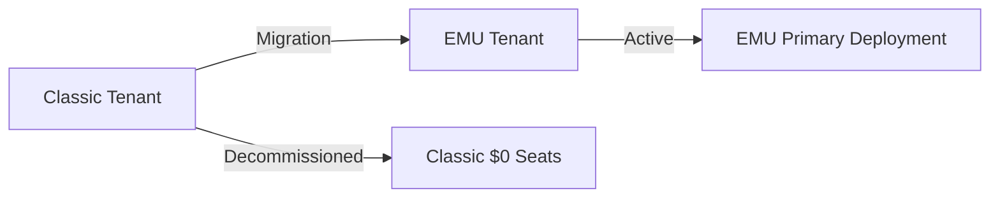

# GitHub Enterprise Licensing & Billing Guide
> **Purpose**: Comprehensive reference for GitHub Enterprise licensing models, deployment types, billing methods, and common patterns encountered in enterprise sales.
---
## Table of Contents
1. [Licensing Models](#licensing-models)
2. [Deployment Types](#deployment-types)
3. [Product SKUs](#product-skus)
4. [Support Tiers](#support-tiers)
5. [Billing Methods](#billing-methods)
6. [Common Account Patterns](#common-account-patterns)
7. [Odometer Data Interpretation](#odometer-data-interpretation)
8. [Revenue Calculation Patterns](#revenue-calculation-patterns)
---
## Licensing Models
GitHub offers two fundamental licensing models:
### Volume Licensing
| Attribute | Description |
|-----------|-------------|
| **Definition** | Pre-purchased annual licenses with committed seat count |
| **Billing Frequency** | Annual (up-front) |
| **Typical Channel** | Microsoft Enterprise Agreement (EA) or GitHub Direct |
| **Products Available** | GitHub Enterprise (GHE), GHAS (Volume SKU) |
| **Contract Terms** | Usually 1-3 year commitments with annual renewal |
| **Utilization Tracking** | Purchased vs. Consumed seats |
**Volume License Fields in Odometer**:
```json
{
  "licensing_type": "Volume",
  "licenses": {
    "purchased": 1880,      // Seats bought
    "consumed": 1859,       // Seats assigned
    "remaining": 21,        // Headroom
    "total_available": 1880,
    "total_consumed": 1859
  }
}
```
### Metered Licensing
| Attribute | Description |
|-----------|-------------|
| **Definition** | Pay-as-you-go based on actual usage |
| **Billing Frequency** | Monthly (arrears) |
| **Typical Channel** | Azure Marketplace, GitHub Direct |
| **Products Available** | Copilot, Actions, Codespaces, Packages, GHAS (Metered SKUs) |
| **Contract Terms** | Month-to-month, no committed seats |
| **Utilization Tracking** | Consumed/Active users only |
**Metered License Fields in Odometer**:
```json
{
  "licensing_type": "Metered",
  "licenses": {
    "metered_consumed": 154,  // Active users this billing period
    "total_consumed": 154
  }
}
```
### Mixed Licensing
Most enterprise customers have **hybrid configurations**:
- **GHE Base**: Volume (annual commitment)
- **GHAS**: Volume OR Metered (customer choice)
- **Copilot**: Always Metered
- **Actions**: Always Metered (beyond included minutes)
- **Support**: Annual (part of contract)
---
## Deployment Types
### GHEC EMU (Enterprise Managed Users)
| Attribute | Value |
|-----------|-------|
| **Product Type** | `GHEC EMU` |
| **Identity Model** | IdP-managed (SAML/OIDC required) |
| **User Provisioning** | SCIM from corporate IdP |
| **Typical Use Case** | Primary enterprise deployment |
| **OSS Contribution** | Requires separate Classic account (see Non-EMU OSS pattern) |
### GHEC Classic
| Attribute | Value |
|-----------|-------|
| **Product Type** | `GHEC classic` |
| **Identity Model** | GitHub.com native accounts |
| **User Provisioning** | Self-service or SAML |
| **Typical Use Case** | Legacy deployments, OSS contributions |
| **Migration Path** | Often migrating to EMU |
### Non-EMU (OSS) - GHOST ACCOUNTS ⚠️
| Attribute | Value |
|-----------|-------|
| **Product Type** | `GHEC classic` |
| **Account Name Pattern** | Contains "Non-EMU (OSS)" |
| **Purpose** | Allow EMU developers to contribute to open source |
| **License Relationship** | **SAME licenses as paired EMU account** |
| **ARR Attribution** | $0 - licenses counted under primary EMU |
| **Consumption** | Minimal (OSS contributions only) |
**Critical Rule**: Non-EMU (OSS) accounts are **ghost/duplicate accounts**. Their licenses are the same as the paired EMU enterprise. **NEVER** add their seat counts to customer totals.
**Detection Pattern**:
```python
def is_ghost_oss_account(account_name: str) -> bool:
    return 'non-emu (oss)' in account_name.lower()
```
### GHES (GitHub Enterprise Server)
| Attribute | Value |
|-----------|-------|
| **Product Type** | `GHES` |
| **Deployment** | On-premise / self-hosted |
| **Identity Model** | Customer-managed (LDAP, SAML, etc.) |
| **Detection** | `gh_connect` field = `1` |
| **Typical Use Case** | Air-gapped, regulated, or latency-sensitive |
### Copilot Standalone
| Attribute | Value |
|-----------|-------|
| **Product Type** | `Copilot Standalone` |
| **GHE Requirement** | None (independent purchase) |
| **Billing** | Azure Marketplace only |
| **Typical Use Case** | Copilot without full GitHub Enterprise |
| **License Model** | Metered (pay-per-seat) |
**Detection**: `copilot_plan` = "Copilot Standalone" in billing data
---
## Product SKUs
### GitHub Enterprise (GHE)
| SKU | Model | Description |
|-----|-------|-------------|
| **GitHub Enterprise Cloud** | Volume | Standard GHEC license |
| **GitHub Enterprise Server** | Volume | On-premise license |
| **VS Bundle (GHE)** | Volume | Near-free GHE via VS subscription |
**Visual Studio Bundle**: Customers with Visual Studio Enterprise subscriptions receive GHE seats at minimal cost. These appear in Odometer as:
```json
{
  "visualStudioBundle_available": 2381,
  "visualStudioBundle_consumed": 244,
  "visualStudioBundle_purchased": 2381,
  "visualStudioBundle_remaining": 2137
}
```
### GitHub Advanced Security (GHAS)
| SKU | Model | Description |
|-----|-------|-------------|
| **Advanced Security (Combined)** | Volume | Code Scanning + Secret Protection |
| **Advanced Security Code Security** | Metered | Code Scanning only (CodeQL/SAST) |
| **Advanced Security Secret Protection** | Metered | Secret Scanning only |
**GHAS Pricing Reference** (approximate):
- Combined Volume: ~$49/seat/year
- Code Security Metered: ~$30/committer/month
- Secret Protection Metered: ~$19/committer/month
### GitHub Copilot
| SKU | Model | Description | Price (approx) |
|-----|-------|-------------|----------------|
| **Copilot Business** | Metered | Standard AI pair programming | $19/seat/month |
| **Copilot Enterprise** | Metered | Chat, knowledge bases, Bing search | $39/seat/month |
| **Copilot Premium Requests** | Metered (consumption) | Over-quota premium model usage | Per-request |
**Copilot Premium Requests**: Truly consumption-based billing for premium model requests (Claude, o1, etc.) beyond included allocation.
### GitHub Actions
| Component | Model | Description |
|-----------|-------|-------------|
| **Included Minutes** | Volume (bundled) | Varies by plan (GHEC includes generous allocation) |
| **Overage Minutes** | Metered | Billed per-minute beyond allocation |
| **Larger Runners** | Metered | Premium compute options |
| **Self-Hosted Runners** | Free | Customer-provided infrastructure |
### Other Products (All Metered)
| Product | Model | Description |
|---------|-------|-------------|
| **Codespaces** | Metered | Cloud development environments |
| **Packages** | Metered | Artifact storage and distribution |
| **Storage** | Metered | Git LFS, Actions artifacts |
---
## Support Tiers
| Tier | Official Name | Cost | Key Features |
|------|---------------|------|--------------|
| **Standard** | Enterprise Support | Free with GHE | Standard SLAs, web support |
| **Premium** | Premium Support | ~10% of license OR free with MSFT Unified | Enhanced SLAs, phone support |
| **Premium Plus** | Premium Plus (GHED) | ~5-10% additional | Dedicated TAM, proactive engagement |
**Support Plan Detection in Odometer**:
```json
{
  "support_plan": "premium_plus_engineering_direct"  // Premium Plus
  "support_plan": "premium_unified"                  // Premium via MSFT
  "support_plan": "premium"                          // Premium standalone
  "support_plan": "standard"                         // Basic included
}
```
---
## Billing Methods
| Method | Description | Typical Use Case |
|--------|-------------|------------------|
| **Zuora** | GitHub Direct billing | Non-MSFT customers, small accounts |
| **Azure** | Azure Marketplace billing | MSFT EA customers, MACC consumption |
| **Hybrid** | Both Zuora + Azure | Volume on EA + Metered on Azure |
**Billing Method in Odometer**:
```json
{
  "billing_methods": ["Zuora", "Azure"]  // Hybrid billing
  "billing_methods": ["Azure"]           // Azure-only (common for MSFT EA)
  "billing_methods": ["Zuora"]           // GitHub Direct only
}
```
---
## Common Account Patterns
### Pattern 1: EMU + Non-EMU OSS (Dual Deployment)
**Description**: Primary EMU for enterprise work, Classic OSS account for open source contributions.
```
Parent Account
├── Primary EMU Account (100% of licenses, 100% of ARR)
│   - Product Type: GHEC EMU
│   - All revenue attributed here
│   - All seat counts from here
└── Non-EMU (OSS) Account (GHOST - 0% unique licenses)
    - Product Type: GHEC classic
    - Account name contains "Non-EMU (OSS)"
    - Same licenses as EMU (DO NOT ADD)
    - Minimal consumption (OSS only)
```
**Examples**:
- Cigna: `cigna-group-internal` (EMU) + `cigna-healthcare` (OSS ghost)
- Keysight: `Keysight-Technologies-Copilot` (EMU) + `keysight` (Classic/OSS)
### Pattern 2: GHEC Environment Migration (Classic → EMU)
**Description**: Customer migrating from GHEC Classic to EMU deployment. This is the most common migration path.
**Why EMU?**: EMU (Enterprise Managed Users) provides:
- IdP-managed identity (SCIM provisioning)
- Better security controls (no personal accounts mixing enterprise work)
- Compliance requirements for regulated industries
**Migration Phases:**
| Phase | Classic (Old) | EMU (New) | What to Expect |
|-------|---------------|-----------|----------------|
| **Pre-Migration** | Full deployment (all users) | Does not exist | Normal state |
| **Migration Start** | Active (decreasing usage) | Created (small/metered) | Users begin moving |
| **Migration Active** | Partially active | Growing | Parallel operation |
| **Migration Complete** | Decommissioned ($0) | Full deployment | Classic turned off |
| **Post-Migration** | "Inactive Contract" | Primary | **Don't misread as churn** |
**Salesforce Account Pattern:**
```
Parent Account
├── Legacy Classic Account (decommissioned)
│   - Product Type: GHEC classic
│   - $0 ARR, 0 seats in Odometer
│   - Account_Contract_Status: "Inactive Contract"
│   - Business slug: company-name
└── New EMU Account (active)
    - Product Type: GHEC EMU
    - Full ARR, active seats
    - Account name often has "-MSFT" suffix
    - Business slug: company-name-emu OR company-emu
```
**Detection Indicators:**
| Indicator | Classic (Old) | EMU (New) |
|-----------|---------------|-----------|
| Slug Pattern | `company-name` | `company-name-emu`, `company-emu` |
| Salesforce Account Name | `Company Name` | `Company Name - MSFT` |
| Odometer Seats | 0 (decommissioned) | Active seats |
| Contract Status | "Inactive Contract" | "Active Contract" |
| ARR | $0 | Full ARR |
**Critical Rule for Analysis:**
> **NEVER conclude a customer has churned based on a single inactive slug.**  
> Always check for alternate slugs with `-emu` suffix or related Salesforce accounts.
**Example - Align Technology:**
```
❌ WRONG Analysis:
   - align-technology slug = 0 seats
   - Contract status = "Inactive"
   - Conclusion: "Customer churned"
✅ CORRECT Analysis:
   - align-technology slug = 0 seats (OLD Classic - decommissioned)
   - align-emu slug = 1,498 seats (NEW EMU - active)
   - Conclusion: "Customer migrated Classic→EMU, fully active"
```
**Tracking Migration History:**
Include in account context/summary files:
```markdown
## Environment Migration History
| Date | Event | From | To | Notes |
|------|-------|------|-----|-------|
| 2024-11 | GHEC Migration | align-technology (Classic) | align-emu (EMU) | Completed |
```
### Pattern 2a: Dual Environment (Permanent)
**Description**: Some customers maintain BOTH Classic and EMU environments long-term.
**Common Reasons:**
- Classic environment for OSS contributions (EMU users can't contribute to public repos)
- Gradual migration taking extended time
- Different business units on different environments
- Contractor workforce on Classic, employees on EMU
**Account Structure:**
```
Parent Account
├── EMU Account (primary enterprise work)
│   - Most users, primary ARR
│   - All commercial features
└── Classic Account (retained for specific use)
    - Smaller user base
    - May be OSS-focused or legacy projects
```
**License Counting Rule:**
- Count BOTH environments if they are legitimately separate deployments
- Do NOT add them together if one is a ghost/OSS account (see Pattern 1)
- Document which environment is primary
### Pattern 3: Copilot Standalone Expansion
**Description**: Copilot-only purchase separate from core GHE.
```
Parent Account
├── Primary GHE Account (EMU or Classic)
│   - GHE licenses
│   - May or may not have integrated Copilot
└── Copilot Standalone Account
    - Product Type: Copilot Standalone
    - Azure billing only
    - No GHE licenses
    - Metered Copilot seats
```
**Example**: Keysight with `keys` (Copilot Standalone, 2 seats)
### Pattern 4: Multi-Account Enterprise (Subsidiaries)
**Description**: Parent company with multiple operating companies on separate deployments.
```
Parent Company
├── Parent Account (may hold contracts, minimal usage)
├── Subsidiary 1 - Integrated (tracked together)
│   - Migrated/merging into parent platform
│   - Revenue rolls up to parent
└── Subsidiary 2 - Independent (tracked separately)
    - Own enterprise deployment
    - Own EA or billing relationship
    - May eventually be spun off
```
**Examples**:
- Cigna: Core business + MDLIVE (integrating) + Zilverton (independent/divesting)
- Danaher: Parent + multiple OpCos (Beckman, Cytiva, IDT, etc.)
### Pattern 5: VS Bundle Heavy
**Description**: Large VS Enterprise subscription providing significant GHE entitlements.
```
Account (typically large Microsoft shop)
├── VS Bundle Seats (low/no cost)
│   - visualStudioBundle_purchased: large number
│   - GHE seats essentially free
└── Direct GHE Purchases (if needed)
    - Only when VS allocation exhausted
```
**ARR Implication**: VS Bundle seats have minimal license ARR despite high seat counts.
---
## Odometer Data Interpretation
### Key Fields Reference
| Field | Meaning | Usage |
|-------|---------|-------|
| `product_type` | Deployment type classification | EMU vs Classic vs Standalone |
| `licensing_type` | Volume vs Metered | Billing model |
| `support_plan` | Support tier | Premium identification |
| `billing_methods` | Payment channels | Direct vs EA |
| `slug` | Enterprise identifier | Cross-reference key |
| `stamp` | Instance (github.com, ghes) | Deployment location |
### Sample Odometer Response Interpretation
```json
{
  "product_type": "GHEC EMU",           // Primary EMU deployment
  "support_plan": "premium_unified",     // Premium via MSFT Unified
  "billing_methods": ["Zuora", "Azure"], // Hybrid billing
  "products": [
    {
      "name": "GitHub Enterprise",
      "licensing_type": "Volume",        // Annual commitment
      "licenses": {
        "purchased": 7966,
        "consumed": 9783,               // OVER allocation (using VS Bundle)
        "visualStudioBundle_available": 2381,
        "visualStudioBundle_consumed": 244
      }
    }
  ],
  "product_features": [
    {"name": "Copilot Business", "seats": 5637},    // Metered Copilot
    {"name": "Copilot Enterprise", "seats": 13},
    {"count": 133825, "name": "Copilot Premium Requests"}, // Consumption
    {"minutes": 277789, "name": "Actions"}
  ]
}
```
---
## Revenue Calculation Patterns
### License ARR Components
| Component | Calculation | Notes |
|-----------|-------------|-------|
| **GHE Volume ARR** | Purchased Seats × Annual Price | From Salesforce |
| **GHE Metered eARR** | Active Users × Monthly Price × 12 | Estimated annual |
| **GHAS Volume ARR** | Purchased Seats × Annual Price | Combined SKU |
| **GHAS Metered eARR** | (Code + Secret) × Monthly × 12 | Component SKUs |
| **Copilot ACR** | (Business × $19 + Enterprise × $39) × 12 | Monthly consumption rate |
| **Support ARR** | % of License ARR | Per support tier |
### Confidence Levels
| Data Source | Confidence | Notes |
|-------------|------------|-------|
| Salesforce ARR | HIGH | Contractual, audited |
| Odometer Seats | HIGH | Real-time platform data |
| Calculated Copilot ACR | MEDIUM | Assumes list pricing |
| Estimated eARR | MEDIUM | Based on current consumption |
| Renewal Dates (API) | HIGH if returned | Some contracts not in API |
| Renewal Dates (inferred) | MEDIUM | From opportunity quotes |
---
## Volume to Metered Transition at Renewal
Customers on Volume (annual commitment) licensing often evaluate a shift to Metered (consumption-based) at renewal. This is a complex commercial decision with trade-offs.
### Key Decision Factors
| Factor | Volume | Metered |
|--------|--------|---------|
| **Predictability** | Fixed annual cost | Variable based on usage |
| **Discount Structure** | EA discounts (historically ~20-30%, declining) | ACD percentage |
| **Budget Model** | CapEx-like (annual commitment) | OpEx-like (pay-as-you-go) |
| **Chargeback** | Harder (one line item) | Easier (per-org/per-product) |
| **Growth Risk** | Overage exposure | Elastic scaling |
| **Admin Overhead** | Lower (set-and-forget) | Higher (monitor consumption) |
### When Volume→Metered Comes Up
1. **Renewal window** - Natural evaluation point
2. **Significant underutilization** - Paying for unused seats
3. **Multi-org/multi-product expansion** - Chargeback needs
4. **Discount erosion** - EA discounts declining over time
5. **Azure MACC availability** - Metered counts toward Azure commitment
### AE Prep at Renewal
When Volume→Metered is on the table:
1. Build side-by-side cost comparison (current EA vs metered at ACD)
2. Model growth scenarios (flat, +10%, +25%)
3. Identify chargeback/admin preferences
4. Align with Microsoft AE on MACC/Azure positioning
---
## Commercial Intelligence Signals (Issue Repos)
These signals are captured from revenue-team issue repos (`commlegal`, `field-operations`, `sales-operations`, `Deal-Desk`)
and should be recorded in `_<directory>_commercial_context.md` for each account.
| Signal | Meaning | Record As |
|--------|---------|-----------|
| **GH Direct -> MSFT EA migration** | Permanent commercial migration milestone | Commercial Milestone (date + issue link) |
| **Order Form required** | Customer requires formal order form for renewals | Commercial Requirement |
| **Recurring bridge licenses** | Multiple bridge requests across distinct years | Renewal Pattern (annual bridge need; often GHES on-prem) |
**Guidance:**
- If bridge requests appear in multiple years, treat it as an annual renewal dependency.
- Capture the migration milestone once and keep it as a permanent, point-in-time record.
---
## Quick Reference: Account Analysis Checklist
When analyzing a customer account:
1. **Identify all business slugs** (Odometer enterprise identifiers)
2. **Check for ghost OSS accounts** (Non-EMU pattern)
3. **Identify deployment types** (EMU, Classic, Standalone, GHES)
4. **Separate Volume vs Metered** licenses
5. **Calculate consolidated totals** (exclude ghosts)
6. **Note support tier** for ARR calculation
7. **Check VS Bundle** impact on effective ARR
8. **Map subsidiary relationships** (integrated vs independent)
---
## Deployment Type Logic (Vault Canonical)
This section is the vault's canonical deployment logic reference.
### Deployment Types (Interpretation Rules)
| Deployment Type | Key Signal | Interpretation |
|-----------------|-----------|----------------|
| **GHEC EMU** | EMU tenant (SSO/IdP) | Primary enterprise deployment for most migrations |
| **GHEC Classic** | Legacy GHEC tenant | Often decommissioned after EMU migration |
| **Non-EMU (OSS)** | “non-emu (oss)” label | **Ghost/duplicate** — exclude from totals |
| **GHES** | Self-hosted/on-prem | Separate deployment; track independently |
| **Copilot Standalone** | Copilot-only licensing | Separate product line; do not merge with GHEC |
### Detection Heuristics (Rules)
1. **Non-EMU (OSS) is always a duplicate**
  - Exclude from consolidated totals and account strategy.
2. **Copilot Standalone is not part of EMU/Classic**
  - Track separately for adoption and expansion.
3. **Volume vs Metered are different commercial models**
  - Do not mix in the same rollups.
4. **Support tier changes effective ARR**
  - Standard (free) → Premium → Premium Plus.
### Migration Patterns (Avoid False Churn)
Common migration path: **GHEC Classic → GHEC EMU**

**Interpretation:**
- Classic going to $0 does **not** imply churn if EMU is active.
- Some customers keep Classic for OSS contributions — treat as duplicate if labeled Non-EMU.
### Consolidation Rules
When aggregating totals:
- **Include:** Active EMU + GHES + Copilot Standalone (separate line items)
- **Exclude:** Non-EMU (OSS) duplicates
---
---
## Related Resources
### Revenue Principles
Territory action framework (use consistent language):
- **Quick Win**
- **LTI** (Long-Term Initiative)
- **Drive Engagement**
Saturation calculations quantify adoption and expansion opportunities.
### Additional References
- [Account Demographics](../Customers/account_demographics.md) - Territory structure and routing
---
*Last Updated: 2026-01-12*
*Document Owner: Revenue Copilot / Account Context Agent*
