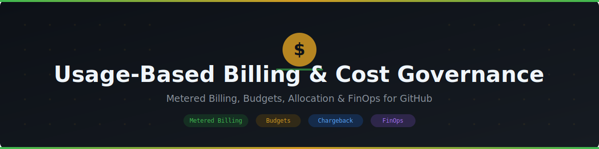

  

  

<h1 align="center">Usage-Based Billing &amp; Cost Governance Resource Pack</h1>

  A practical guide for understanding GitHub's metered billing model, controlling AI and compute spend, and building the governance and reporting muscle needed to scale usage-based products responsibly.

## Contents

| # | Document | Description |
|---|----------|-------------|
| 01 | [Understanding Metered Billing](./01-Understanding-Metered-Billing.md) | How GitHub's usage-based billing model works across Copilot, Actions, storage, packages, and Codespaces |
| 02 | [Token Budget Management](./02-Token-Budget-Management.md) | Managing Copilot premium request and token consumption, and optimizing prompt/model usage |
| 03 | [Cost Allocation and Chargeback](./03-Cost-Allocation-and-Chargeback.md) | Attributing spend to teams, organizations, and business units with defensible chargeback models |
| 04 | [Spending Limits and Budget Alerts](./04-Spending-Limits-and-Budget-Alerts.md) | Configuring spending limits, budgets, and proactive alerting to prevent bill shock |
| 05 | [Seat and Minutes Optimization](./05-Seat-and-Minutes-Optimization.md) | Right-sizing Copilot seats and optimizing Actions minutes and storage costs |
| 06 | [Governance and Reporting](./06-Governance-and-Reporting.md) | Building a FinOps-style governance framework with recurring reporting and executive scorecards |

## How to Use

1. **New to metered billing?** Start with [01-Understanding-Metered-Billing](./01-Understanding-Metered-Billing.md) to learn how usage translates into cost across GitHub's product surface.
2. **Rolling out Copilot at scale?** Use [02-Token-Budget-Management](./02-Token-Budget-Management.md) and [05-Seat-and-Minutes-Optimization](./05-Seat-and-Minutes-Optimization.md) to keep consumption predictable.
3. **Need to bill back internal teams?** Apply [03-Cost-Allocation-and-Chargeback](./03-Cost-Allocation-and-Chargeback.md) to design a fair, auditable allocation model.
4. **Worried about surprise bills?** Configure [04-Spending-Limits-and-Budget-Alerts](./04-Spending-Limits-and-Budget-Alerts.md) before scaling usage further.
5. **Building an enterprise FinOps practice?** Operationalize [06-Governance-and-Reporting](./06-Governance-and-Reporting.md) with clear owners, cadences, and dashboards.

## Suggested Rollout Sequence

- **Week 1-2:** Inventory current usage-based products (Copilot, Actions, storage, packages, Codespaces) and baseline monthly spend.
- **Week 3-4:** Stand up spending limits, budget alerts, and a cost-allocation tagging convention.
- **Week 5-8:** Publish chargeback reports to business units and tune Copilot seat assignments.
- **Week 8+:** Formalize a recurring FinOps review cadence and roll governance into onboarding for new teams.

## Reference Sources

- [About billing for GitHub](https://docs.github.com/en/billing/managing-the-plan-for-your-github-account/about-billing-for-github-accounts)
- [About billing for GitHub Copilot](https://docs.github.com/en/copilot/managing-copilot/managing-github-copilot-in-your-organization/managing-github-copilot-for-your-enterprise/about-billing-for-github-copilot)
- [Managing your spending limit for GitHub Actions](https://docs.github.com/en/billing/managing-billing-for-your-products/managing-billing-for-github-actions/managing-your-spending-limit-for-github-actions)
- [Viewing your GitHub Actions usage](https://docs.github.com/en/billing/managing-billing-for-your-products/managing-billing-for-github-actions/viewing-your-github-actions-usage)
- [About budgets](https://docs.github.com/en/billing/managing-the-plan-for-your-github-account/about-budgets)
- [Roles for an enterprise](https://docs.github.com/en/enterprise-cloud@latest/admin/user-management/managing-users-in-your-enterprise/roles-in-an-enterprise)
